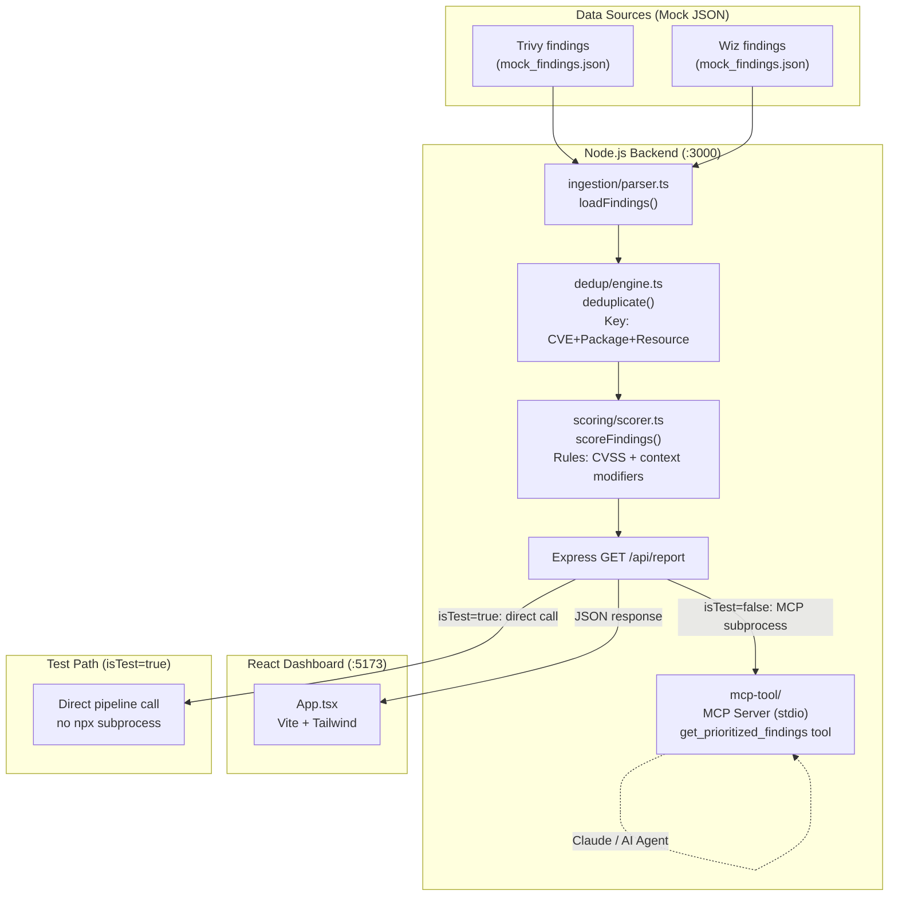

# Architecture — cspm-noise-reduction-agent
> Last updated: 2026-08-29 | Maturity: Functional Prototype
> _Working deduplication + contextual scoring pipeline over 150+ mock findings. MCP subprocess is bypassed in tests via `isTest` guard; real MCP path requires `npx ts-node` in PATH._

---

## System Architecture

---

## Component Table

| Component | File | Responsibility | Tech |
|---|---|---|---|
| Express API | `backend/src/index.ts` | `/api/report` endpoint; routes to MCP or direct call | TypeScript, Express |
| Ingestion parser | `backend/src/ingestion/parser.ts` | Loads findings from `data/mock_findings.json` | TypeScript |
| Dedup engine | `backend/src/dedup/engine.ts` | Collapses duplicate findings by `CVE + package + resource` | TypeScript |
| Scorer | `backend/src/scoring/scorer.ts` | Rules-based CVSS adjustment (internet-facing, exploit available, runtime-loaded) | TypeScript |
| MCP server | `backend/src/mcp-tool/` | Exposes `get_prioritized_findings` tool to AI agents via stdio | MCP SDK |
| React dashboard | `dashboard/src/App.tsx` | Visualizes noise reduction metrics and prioritized tickets | React, Vite, Tailwind |
| Mock data generator | `scripts/generate_mock_data.js` | Generates 150+ realistic multi-scanner findings | Node.js |

---

## Port Assignments

| Service | Port | Notes |
|---|---|---|
| Backend API | 3000 | `GET /api/report` |
| React Dashboard | 5173 | Vite dev server |
| MCP Server | stdio (no HTTP) | Spawned as subprocess when API is called in production |

---

## Scoring Logic

The `scoreFindings()` function adjusts base CVSS score (0–10) with contextual modifiers:

| Condition | Modifier |
|---|---|
| `internetFacing = true` | +2.0 |
| `publicExploitAvailable = true` | +3.0 |
| `loadedAtRuntime = false` | -4.0 |

Priority thresholds: CRITICAL ≥ 9.0 | HIGH ≥ 7.0 | MEDIUM ≥ 4.0 | LOW < 4.0

---

## Dependency Table

| Dependency | Status | Notes |
|---|---|---|
| Mock findings JSON | **Mocked** | `data/mock_findings.json` — 150+ synthetic findings; no real scanner output |
| MCP SDK subprocess | **Bypassed in tests** | `isTest` guard calls scoring pipeline directly in Jest |
| Jira / ServiceNow | **Not implemented** | Adapter interfaces exist; actual API calls stubbed |
| LLM (OpenAI) | **Simulated** | `summarizeWithLLM()` uses mock delay + deterministic text when no API key provided |

---

## Key Engineering Decisions

| Decision | Rationale |
|---|---|
| Rules-based scoring over pure LLM | Deterministic, fast, auditable. LLM reserved for human-readable summaries only |
| Dedup key = CVE + Package + Resource | Same CVE in same package on same resource from different scanners = same underlying issue |
| MCP Server integration | Exposes findings to AI coding assistants (Claude) for automated remediation suggestions |
| `isTest` guard in Express handler | Avoids spawning `npx ts-node` subprocess in Jest; keeps tests self-contained and CI-friendly |
